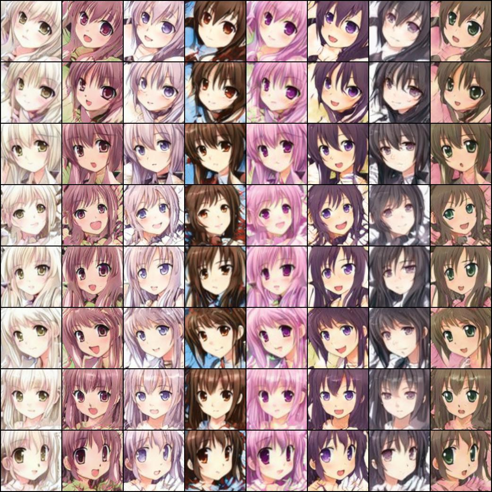

Anime Faces Generation with StyleGAN
====================================

The original training code can be obtained from [lucidrains/stylegan-pytorch](https://github.com/lucidrains/stylegan2-pytorch).

The training data should be collected manually. A usual solution is to collect by a spider of [Konachan](https://konachan.com/) and to crop square images of human head by a script using [the face detector for anime/manga using OpenCV](https://github.com/nagadomi/lbpcascade_animeface).

With the configurations in `.config.json`, the first generation after finishing training should be like the image shown below.

